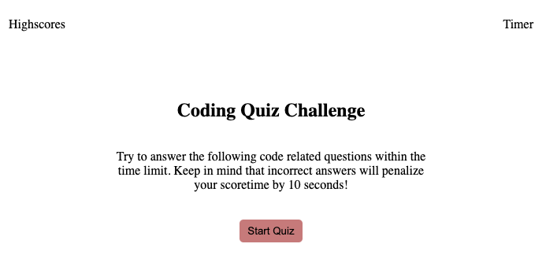

# Test-Your-Coding-Knowledge-Quiz

This is a simple quiz application built with HTML, CSS, and JavaScript. The quiz contains 10 multiple-choice questions about JavaScript, and the user has 30 seconds to answer each question. At the end of the quiz, the user is able to save their score to local storage and view the high scores.

## Demo
* Here's a demo of the quiz application:

## Links

* Link to Github: https://github.com/bryxzi
* Link to Repo: https://github.com/bryxzi/Test-Your-Coding-Knowledge-Quiz
* Live Deployment: https://bryxzi.github.io/Test-Your-Coding-Knowledge-Quiz/

## Features
* 10 multiple-choice questions about JavaScript
* 30 seconds time limit
* Local storage to save high scores
* View saved high scores

## Technologies
* HTML
* CSS
* JavaScript

## Usage
To use the quiz application, follow these steps:

* Click the "Start Quiz" button to begin the quiz.
* Answer each question by selecting one of the multiple-choice options.
* If you answer a question incorrectly, 5 seconds will be deducted from the timer.
* At the end of the quiz, you will be asked to enter your initials to save your score to local storage.
* Click the "View High Scores" button to view the high scores.

## License
This project is licensed under the MIT License. Feel free to use and modify this code as you see fit.
Entry level coding quiz, testing the fundamentals of HTML CSS and Javascript
